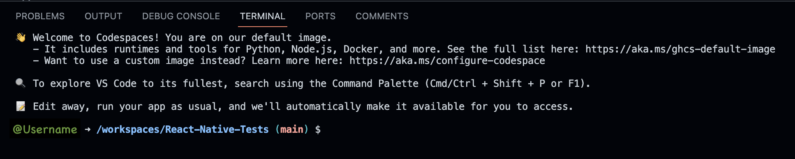
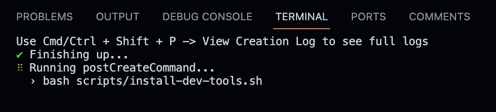
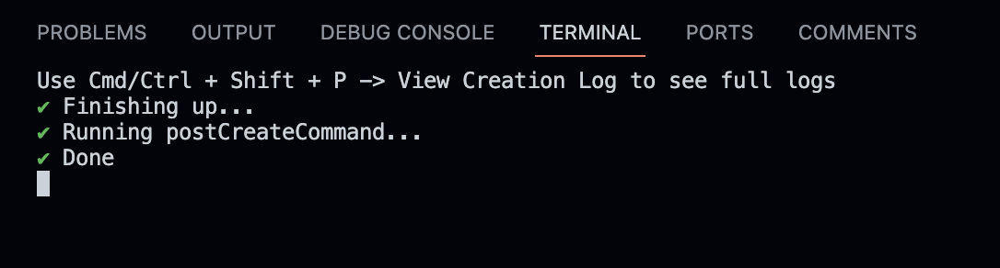
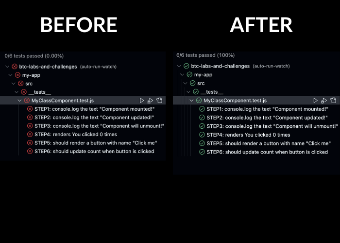

# IMPORTANT!
## Wait for VSCode to finish setting up dependencies

1. Once VSCode opens for the first time you should briefly see the following in the terminal. 

2. Then it should quickly change to following and will run for a few minutes.

3. Once packages and dependencies required for the project are all installed, you will see the following for a brief moment:

4. Then it should change to this, indicating the Editor is ready to use:

## Exersize 

1. Open Command Pallet and lauch test Explorer 
    - View > Command Palet 
    - type in: Jest: Start All Runners
2. Implement all Steps Required
    - Step 1: implement lifecycle method called componentDidMount(). Inside componentDidMount() method. log 'Component mounted!' to the console.
    - Step 2: implement lifecycle method called componentDidUpdate(). Inside componentDidUpdate() method. log 'Component updated!' to the console.
    - Step 3: implement lifecycle method called componentWillUnmount(). Inside componentWillUnmount() method. log 'Component will unmount!' to the console.
    - Step 4: replace X in `
You clicked X times
` with JavaScript expression rendering 'this.state.count'.
    - Step 5: dd a button named Click me just below `
You clicked...
` paragraph. onClick of the button 'this.handleClick' should be called
    - Step 6: increment variable this.state.count by 1 and set it's state by calling this.setState()
3. Make sure All tests passes

